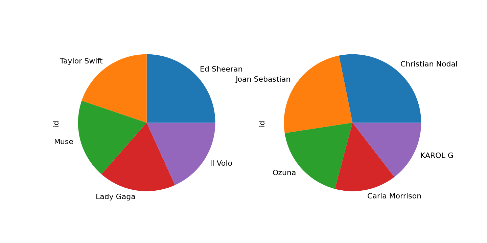
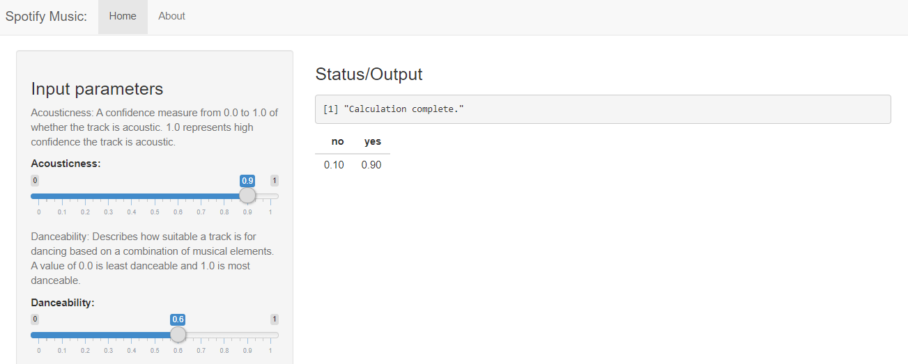

Spotify Presentation
========================================================
author: Miryam Elizabeth
date: 28 november, 2021
autosize: true

Spotify Music
========================================================

An interactive app to easily explore music of Spofity. The app utilizes a custom dataset, which was collected using Spotify's API. The idea is to predict whether you will like a song or not, based on your musical preferences.

Each song has different attributes such as name, artist, duration, and music-related features such as energy, instrumentality, tempo, how danceable it is, etc.

- More information on the Spotify's API can be found <a href='https://developer.spotify.com/documentation/web-api/reference/#/operations/get-several-audio-features'>here</a>.

Dataset
========================================================

The first 100 rows of the data being explored.

<table class="table" style="font-size: 18px; margin-left: auto; margin-right: auto;">
 <thead>
  <tr>
   <th style="text-align:left;position: sticky; top:0; background-color: #FFFFFF;">   </th>
   <th style="text-align:center;position: sticky; top:0; background-color: #FFFFFF;"> artist </th>
   <th style="text-align:center;position: sticky; top:0; background-color: #FFFFFF;"> danceability </th>
   <th style="text-align:center;position: sticky; top:0; background-color: #FFFFFF;"> energy </th>
   <th style="text-align:center;position: sticky; top:0; background-color: #FFFFFF;"> speechiness </th>
   <th style="text-align:center;position: sticky; top:0; background-color: #FFFFFF;"> acousticness </th>
   <th style="text-align:center;position: sticky; top:0; background-color: #FFFFFF;"> instrumentalness </th>
   <th style="text-align:center;position: sticky; top:0; background-color: #FFFFFF;"> valence </th>
   <th style="text-align:center;position: sticky; top:0; background-color: #FFFFFF;"> class </th>
  </tr>
 </thead>
<tbody>
  <tr>
   <td style="text-align:left;"> 910 </td>
   <td style="text-align:center;"> P!nk </td>
   <td style="text-align:center;"> 0.688 </td>
   <td style="text-align:center;"> 0.7340 </td>
   <td style="text-align:center;"> 0.0274 </td>
   <td style="text-align:center;"> 0.004620 </td>
   <td style="text-align:center;"> 0.00e+00 </td>
   <td style="text-align:center;"> 0.4600 </td>
   <td style="text-align:center;"> yes </td>
  </tr>
  <tr>
   <td style="text-align:left;"> 298 </td>
   <td style="text-align:center;"> Ed Sheeran </td>
   <td style="text-align:center;"> 0.641 </td>
   <td style="text-align:center;"> 0.1760 </td>
   <td style="text-align:center;"> 0.0349 </td>
   <td style="text-align:center;"> 0.638000 </td>
   <td style="text-align:center;"> 5.10e-06 </td>
   <td style="text-align:center;"> 0.2970 </td>
   <td style="text-align:center;"> yes </td>
  </tr>
  <tr>
   <td style="text-align:left;"> 1735 </td>
   <td style="text-align:center;"> El Komander </td>
   <td style="text-align:center;"> 0.582 </td>
   <td style="text-align:center;"> 0.4460 </td>
   <td style="text-align:center;"> 0.0351 </td>
   <td style="text-align:center;"> 0.268000 </td>
   <td style="text-align:center;"> 0.00e+00 </td>
   <td style="text-align:center;"> 0.6850 </td>
   <td style="text-align:center;"> no </td>
  </tr>
  <tr>
   <td style="text-align:left;"> 1537 </td>
   <td style="text-align:center;"> Enigma Norteño </td>
   <td style="text-align:center;"> 0.718 </td>
   <td style="text-align:center;"> 0.8350 </td>
   <td style="text-align:center;"> 0.0309 </td>
   <td style="text-align:center;"> 0.429000 </td>
   <td style="text-align:center;"> 0.00e+00 </td>
   <td style="text-align:center;"> 0.9030 </td>
   <td style="text-align:center;"> no </td>
  </tr>
  <tr>
   <td style="text-align:left;"> 55 </td>
   <td style="text-align:center;"> Ennio Morricone </td>
   <td style="text-align:center;"> 0.089 </td>
   <td style="text-align:center;"> 0.1860 </td>
   <td style="text-align:center;"> 0.0388 </td>
   <td style="text-align:center;"> 0.951000 </td>
   <td style="text-align:center;"> 9.21e-01 </td>
   <td style="text-align:center;"> 0.0361 </td>
   <td style="text-align:center;"> yes </td>
  </tr>
  <tr>
   <td style="text-align:left;"> 1336 </td>
   <td style="text-align:center;"> Martin Trevy </td>
   <td style="text-align:center;"> 0.755 </td>
   <td style="text-align:center;"> 0.8120 </td>
   <td style="text-align:center;"> 0.0563 </td>
   <td style="text-align:center;"> 0.007100 </td>
   <td style="text-align:center;"> 6.70e-03 </td>
   <td style="text-align:center;"> 0.3490 </td>
   <td style="text-align:center;"> no </td>
  </tr>
  <tr>
   <td style="text-align:left;"> 531 </td>
   <td style="text-align:center;"> Maroon 5 </td>
   <td style="text-align:center;"> 0.410 </td>
   <td style="text-align:center;"> 0.3270 </td>
   <td style="text-align:center;"> 0.0301 </td>
   <td style="text-align:center;"> 0.547000 </td>
   <td style="text-align:center;"> 0.00e+00 </td>
   <td style="text-align:center;"> 0.2830 </td>
   <td style="text-align:center;"> yes </td>
  </tr>
  <tr>
   <td style="text-align:left;"> 1725 </td>
   <td style="text-align:center;"> Joan Sebastian </td>
   <td style="text-align:center;"> 0.719 </td>
   <td style="text-align:center;"> 0.4600 </td>
   <td style="text-align:center;"> 0.0332 </td>
   <td style="text-align:center;"> 0.891000 </td>
   <td style="text-align:center;"> 7.81e-05 </td>
   <td style="text-align:center;"> 0.8810 </td>
   <td style="text-align:center;"> no </td>
  </tr>
  <tr>
   <td style="text-align:left;"> 888 </td>
   <td style="text-align:center;"> Taylor Swift </td>
   <td style="text-align:center;"> 0.499 </td>
   <td style="text-align:center;"> 0.4670 </td>
   <td style="text-align:center;"> 0.0461 </td>
   <td style="text-align:center;"> 0.005930 </td>
   <td style="text-align:center;"> 1.70e-06 </td>
   <td style="text-align:center;"> 0.6370 </td>
   <td style="text-align:center;"> yes </td>
  </tr>
  <tr>
   <td style="text-align:left;"> 1812 </td>
   <td style="text-align:center;"> Jovanny Cadena Y Su Estilo Privado </td>
   <td style="text-align:center;"> 0.652 </td>
   <td style="text-align:center;"> 0.2910 </td>
   <td style="text-align:center;"> 0.0306 </td>
   <td style="text-align:center;"> 0.772000 </td>
   <td style="text-align:center;"> 9.93e-05 </td>
   <td style="text-align:center;"> 0.5800 </td>
   <td style="text-align:center;"> no </td>
  </tr>
  <tr>
   <td style="text-align:left;"> 1807 </td>
   <td style="text-align:center;"> Eslabon Armado </td>
   <td style="text-align:center;"> 0.690 </td>
   <td style="text-align:center;"> 0.6330 </td>
   <td style="text-align:center;"> 0.0319 </td>
   <td style="text-align:center;"> 0.243000 </td>
   <td style="text-align:center;"> 0.00e+00 </td>
   <td style="text-align:center;"> 0.8840 </td>
   <td style="text-align:center;"> no </td>
  </tr>
  <tr>
   <td style="text-align:left;"> 1864 </td>
   <td style="text-align:center;"> Toser One </td>
   <td style="text-align:center;"> 0.799 </td>
   <td style="text-align:center;"> 0.6790 </td>
   <td style="text-align:center;"> 0.3580 </td>
   <td style="text-align:center;"> 0.645000 </td>
   <td style="text-align:center;"> 0.00e+00 </td>
   <td style="text-align:center;"> 0.7950 </td>
   <td style="text-align:center;"> no </td>
  </tr>
  <tr>
   <td style="text-align:left;"> 1592 </td>
   <td style="text-align:center;"> Aya Nakamura </td>
   <td style="text-align:center;"> 0.791 </td>
   <td style="text-align:center;"> 0.6820 </td>
   <td style="text-align:center;"> 0.1580 </td>
   <td style="text-align:center;"> 0.175000 </td>
   <td style="text-align:center;"> 0.00e+00 </td>
   <td style="text-align:center;"> 0.6720 </td>
   <td style="text-align:center;"> no </td>
  </tr>
  <tr>
   <td style="text-align:left;"> 1175 </td>
   <td style="text-align:center;"> Banda El Recodo </td>
   <td style="text-align:center;"> 0.799 </td>
   <td style="text-align:center;"> 0.5340 </td>
   <td style="text-align:center;"> 0.0320 </td>
   <td style="text-align:center;"> 0.289000 </td>
   <td style="text-align:center;"> 0.00e+00 </td>
   <td style="text-align:center;"> 0.9610 </td>
   <td style="text-align:center;"> no </td>
  </tr>
  <tr>
   <td style="text-align:left;"> 894 </td>
   <td style="text-align:center;"> Katy Perry </td>
   <td style="text-align:center;"> 0.699 </td>
   <td style="text-align:center;"> 0.7600 </td>
   <td style="text-align:center;"> 0.0677 </td>
   <td style="text-align:center;"> 0.002230 </td>
   <td style="text-align:center;"> 0.00e+00 </td>
   <td style="text-align:center;"> 0.6960 </td>
   <td style="text-align:center;"> yes </td>
  </tr>
  <tr>
   <td style="text-align:left;"> 814 </td>
   <td style="text-align:center;"> Calvin Harris </td>
   <td style="text-align:center;"> 0.707 </td>
   <td style="text-align:center;"> 0.9240 </td>
   <td style="text-align:center;"> 0.0310 </td>
   <td style="text-align:center;"> 0.000972 </td>
   <td style="text-align:center;"> 7.03e-03 </td>
   <td style="text-align:center;"> 0.9190 </td>
   <td style="text-align:center;"> yes </td>
  </tr>
  <tr>
   <td style="text-align:left;"> 979 </td>
   <td style="text-align:center;"> Ha*Ash </td>
   <td style="text-align:center;"> 0.586 </td>
   <td style="text-align:center;"> 0.8950 </td>
   <td style="text-align:center;"> 0.0867 </td>
   <td style="text-align:center;"> 0.114000 </td>
   <td style="text-align:center;"> 0.00e+00 </td>
   <td style="text-align:center;"> 0.3820 </td>
   <td style="text-align:center;"> yes </td>
  </tr>
  <tr>
   <td style="text-align:left;"> 680 </td>
   <td style="text-align:center;"> Justin Bieber </td>
   <td style="text-align:center;"> 0.609 </td>
   <td style="text-align:center;"> 0.3780 </td>
   <td style="text-align:center;"> 0.4380 </td>
   <td style="text-align:center;"> 0.835000 </td>
   <td style="text-align:center;"> 0.00e+00 </td>
   <td style="text-align:center;"> 0.5150 </td>
   <td style="text-align:center;"> yes </td>
  </tr>
  <tr>
   <td style="text-align:left;"> 1113 </td>
   <td style="text-align:center;"> Carla Morrison </td>
   <td style="text-align:center;"> 0.689 </td>
   <td style="text-align:center;"> 0.2630 </td>
   <td style="text-align:center;"> 0.0306 </td>
   <td style="text-align:center;"> 0.842000 </td>
   <td style="text-align:center;"> 9.90e-06 </td>
   <td style="text-align:center;"> 0.3040 </td>
   <td style="text-align:center;"> no </td>
  </tr>
  <tr>
   <td style="text-align:left;"> 197 </td>
   <td style="text-align:center;"> The Weeknd </td>
   <td style="text-align:center;"> 0.667 </td>
   <td style="text-align:center;"> 0.7190 </td>
   <td style="text-align:center;"> 0.0346 </td>
   <td style="text-align:center;"> 0.002850 </td>
   <td style="text-align:center;"> 8.10e-05 </td>
   <td style="text-align:center;"> 0.7170 </td>
   <td style="text-align:center;"> yes </td>
  </tr>
  <tr>
   <td style="text-align:left;"> 1466 </td>
   <td style="text-align:center;"> Los Mier </td>
   <td style="text-align:center;"> 0.688 </td>
   <td style="text-align:center;"> 0.5870 </td>
   <td style="text-align:center;"> 0.0370 </td>
   <td style="text-align:center;"> 0.361000 </td>
   <td style="text-align:center;"> 0.00e+00 </td>
   <td style="text-align:center;"> 0.9650 </td>
   <td style="text-align:center;"> no </td>
  </tr>
  <tr>
   <td style="text-align:left;"> 1132 </td>
   <td style="text-align:center;"> Christian Nodal </td>
   <td style="text-align:center;"> 0.653 </td>
   <td style="text-align:center;"> 0.5380 </td>
   <td style="text-align:center;"> 0.0309 </td>
   <td style="text-align:center;"> 0.354000 </td>
   <td style="text-align:center;"> 0.00e+00 </td>
   <td style="text-align:center;"> 0.8040 </td>
   <td style="text-align:center;"> no </td>
  </tr>
  <tr>
   <td style="text-align:left;"> 1020 </td>
   <td style="text-align:center;"> Bee Gees </td>
   <td style="text-align:center;"> 0.633 </td>
   <td style="text-align:center;"> 0.3570 </td>
   <td style="text-align:center;"> 0.0264 </td>
   <td style="text-align:center;"> 0.105000 </td>
   <td style="text-align:center;"> 0.00e+00 </td>
   <td style="text-align:center;"> 0.6740 </td>
   <td style="text-align:center;"> yes </td>
  </tr>
  <tr>
   <td style="text-align:left;"> 358 </td>
   <td style="text-align:center;"> Lana Del Rey </td>
   <td style="text-align:center;"> 0.545 </td>
   <td style="text-align:center;"> 0.2600 </td>
   <td style="text-align:center;"> 0.0289 </td>
   <td style="text-align:center;"> 0.788000 </td>
   <td style="text-align:center;"> 9.90e-04 </td>
   <td style="text-align:center;"> 0.1850 </td>
   <td style="text-align:center;"> yes </td>
  </tr>
  <tr>
   <td style="text-align:left;"> 1425 </td>
   <td style="text-align:center;"> Septeto Acarey </td>
   <td style="text-align:center;"> 0.626 </td>
   <td style="text-align:center;"> 0.8010 </td>
   <td style="text-align:center;"> 0.0342 </td>
   <td style="text-align:center;"> 0.261000 </td>
   <td style="text-align:center;"> 2.46e-05 </td>
   <td style="text-align:center;"> 0.9030 </td>
   <td style="text-align:center;"> no </td>
  </tr>
  <tr>
   <td style="text-align:left;"> 520 </td>
   <td style="text-align:center;"> Charlie Puth </td>
   <td style="text-align:center;"> 0.362 </td>
   <td style="text-align:center;"> 0.2680 </td>
   <td style="text-align:center;"> 0.0399 </td>
   <td style="text-align:center;"> 0.909000 </td>
   <td style="text-align:center;"> 0.00e+00 </td>
   <td style="text-align:center;"> 0.3940 </td>
   <td style="text-align:center;"> yes </td>
  </tr>
  <tr>
   <td style="text-align:left;"> 1055 </td>
   <td style="text-align:center;"> Greeicy </td>
   <td style="text-align:center;"> 0.827 </td>
   <td style="text-align:center;"> 0.8140 </td>
   <td style="text-align:center;"> 0.0631 </td>
   <td style="text-align:center;"> 0.109000 </td>
   <td style="text-align:center;"> 1.35e-04 </td>
   <td style="text-align:center;"> 0.5060 </td>
   <td style="text-align:center;"> no </td>
  </tr>
  <tr>
   <td style="text-align:left;"> 342 </td>
   <td style="text-align:center;"> Lana Del Rey </td>
   <td style="text-align:center;"> 0.245 </td>
   <td style="text-align:center;"> 0.4920 </td>
   <td style="text-align:center;"> 0.0593 </td>
   <td style="text-align:center;"> 0.466000 </td>
   <td style="text-align:center;"> 0.00e+00 </td>
   <td style="text-align:center;"> 0.1040 </td>
   <td style="text-align:center;"> yes </td>
  </tr>
  <tr>
   <td style="text-align:left;"> 1049 </td>
   <td style="text-align:center;"> KAROL G </td>
   <td style="text-align:center;"> 0.832 </td>
   <td style="text-align:center;"> 0.8120 </td>
   <td style="text-align:center;"> 0.0885 </td>
   <td style="text-align:center;"> 0.216000 </td>
   <td style="text-align:center;"> 6.77e-05 </td>
   <td style="text-align:center;"> 0.6580 </td>
   <td style="text-align:center;"> no </td>
  </tr>
  <tr>
   <td style="text-align:left;"> 836 </td>
   <td style="text-align:center;"> Sarah Morgann </td>
   <td style="text-align:center;"> 0.326 </td>
   <td style="text-align:center;"> 0.1240 </td>
   <td style="text-align:center;"> 0.0361 </td>
   <td style="text-align:center;"> 0.980000 </td>
   <td style="text-align:center;"> 4.88e-03 </td>
   <td style="text-align:center;"> 0.4570 </td>
   <td style="text-align:center;"> yes </td>
  </tr>
  <tr>
   <td style="text-align:left;"> 477 </td>
   <td style="text-align:center;"> Lady Gaga </td>
   <td style="text-align:center;"> 0.493 </td>
   <td style="text-align:center;"> 0.3730 </td>
   <td style="text-align:center;"> 0.0524 </td>
   <td style="text-align:center;"> 0.952000 </td>
   <td style="text-align:center;"> 9.81e-01 </td>
   <td style="text-align:center;"> 0.5650 </td>
   <td style="text-align:center;"> yes </td>
  </tr>
  <tr>
   <td style="text-align:left;"> 249 </td>
   <td style="text-align:center;"> Taylor Swift </td>
   <td style="text-align:center;"> 0.313 </td>
   <td style="text-align:center;"> 0.2580 </td>
   <td style="text-align:center;"> 0.0383 </td>
   <td style="text-align:center;"> 0.842000 </td>
   <td style="text-align:center;"> 1.30e-06 </td>
   <td style="text-align:center;"> 0.2680 </td>
   <td style="text-align:center;"> yes </td>
  </tr>
  <tr>
   <td style="text-align:left;"> 881 </td>
   <td style="text-align:center;"> Ronan Keating </td>
   <td style="text-align:center;"> 0.456 </td>
   <td style="text-align:center;"> 0.4480 </td>
   <td style="text-align:center;"> 0.0251 </td>
   <td style="text-align:center;"> 0.161000 </td>
   <td style="text-align:center;"> 1.20e-06 </td>
   <td style="text-align:center;"> 0.4180 </td>
   <td style="text-align:center;"> yes </td>
  </tr>
  <tr>
   <td style="text-align:left;"> 1816 </td>
   <td style="text-align:center;"> LDNE </td>
   <td style="text-align:center;"> 0.660 </td>
   <td style="text-align:center;"> 0.4990 </td>
   <td style="text-align:center;"> 0.0316 </td>
   <td style="text-align:center;"> 0.588000 </td>
   <td style="text-align:center;"> 0.00e+00 </td>
   <td style="text-align:center;"> 0.3470 </td>
   <td style="text-align:center;"> no </td>
  </tr>
  <tr>
   <td style="text-align:left;"> 1680 </td>
   <td style="text-align:center;"> Melissa Galindo </td>
   <td style="text-align:center;"> 0.503 </td>
   <td style="text-align:center;"> 0.8110 </td>
   <td style="text-align:center;"> 0.2950 </td>
   <td style="text-align:center;"> 0.380000 </td>
   <td style="text-align:center;"> 0.00e+00 </td>
   <td style="text-align:center;"> 0.5840 </td>
   <td style="text-align:center;"> no </td>
  </tr>
  <tr>
   <td style="text-align:left;"> 864 </td>
   <td style="text-align:center;"> Usher </td>
   <td style="text-align:center;"> 0.895 </td>
   <td style="text-align:center;"> 0.7950 </td>
   <td style="text-align:center;"> 0.0977 </td>
   <td style="text-align:center;"> 0.021900 </td>
   <td style="text-align:center;"> 0.00e+00 </td>
   <td style="text-align:center;"> 0.5740 </td>
   <td style="text-align:center;"> yes </td>
  </tr>
  <tr>
   <td style="text-align:left;"> 980 </td>
   <td style="text-align:center;"> Ha*Ash </td>
   <td style="text-align:center;"> 0.262 </td>
   <td style="text-align:center;"> 0.5030 </td>
   <td style="text-align:center;"> 0.0368 </td>
   <td style="text-align:center;"> 0.758000 </td>
   <td style="text-align:center;"> 0.00e+00 </td>
   <td style="text-align:center;"> 0.3240 </td>
   <td style="text-align:center;"> yes </td>
  </tr>
  <tr>
   <td style="text-align:left;"> 868 </td>
   <td style="text-align:center;"> Coldplay </td>
   <td style="text-align:center;"> 0.485 </td>
   <td style="text-align:center;"> 0.6190 </td>
   <td style="text-align:center;"> 0.0289 </td>
   <td style="text-align:center;"> 0.094100 </td>
   <td style="text-align:center;"> 3.30e-06 </td>
   <td style="text-align:center;"> 0.4160 </td>
   <td style="text-align:center;"> yes </td>
  </tr>
  <tr>
   <td style="text-align:left;"> 945 </td>
   <td style="text-align:center;"> U2 </td>
   <td style="text-align:center;"> 0.526 </td>
   <td style="text-align:center;"> 0.6650 </td>
   <td style="text-align:center;"> 0.0243 </td>
   <td style="text-align:center;"> 0.407000 </td>
   <td style="text-align:center;"> 2.71e-04 </td>
   <td style="text-align:center;"> 0.2850 </td>
   <td style="text-align:center;"> yes </td>
  </tr>
  <tr>
   <td style="text-align:left;"> 130 </td>
   <td style="text-align:center;"> Selena Gomez </td>
   <td style="text-align:center;"> 0.811 </td>
   <td style="text-align:center;"> 0.5120 </td>
   <td style="text-align:center;"> 0.1730 </td>
   <td style="text-align:center;"> 0.216000 </td>
   <td style="text-align:center;"> 2.66e-02 </td>
   <td style="text-align:center;"> 0.3360 </td>
   <td style="text-align:center;"> yes </td>
  </tr>
  <tr>
   <td style="text-align:left;"> 1904 </td>
   <td style="text-align:center;"> Coko Yamasaki </td>
   <td style="text-align:center;"> 0.887 </td>
   <td style="text-align:center;"> 0.6080 </td>
   <td style="text-align:center;"> 0.1770 </td>
   <td style="text-align:center;"> 0.016200 </td>
   <td style="text-align:center;"> 2.25e-05 </td>
   <td style="text-align:center;"> 0.5430 </td>
   <td style="text-align:center;"> no </td>
  </tr>
  <tr>
   <td style="text-align:left;"> 1253 </td>
   <td style="text-align:center;"> JAY-Z </td>
   <td style="text-align:center;"> 0.509 </td>
   <td style="text-align:center;"> 0.9520 </td>
   <td style="text-align:center;"> 0.3360 </td>
   <td style="text-align:center;"> 0.144000 </td>
   <td style="text-align:center;"> 0.00e+00 </td>
   <td style="text-align:center;"> 0.7000 </td>
   <td style="text-align:center;"> no </td>
  </tr>
  <tr>
   <td style="text-align:left;"> 1778 </td>
   <td style="text-align:center;"> Cardenales De Nuevo León </td>
   <td style="text-align:center;"> 0.808 </td>
   <td style="text-align:center;"> 0.7090 </td>
   <td style="text-align:center;"> 0.0442 </td>
   <td style="text-align:center;"> 0.152000 </td>
   <td style="text-align:center;"> 2.41e-04 </td>
   <td style="text-align:center;"> 0.8530 </td>
   <td style="text-align:center;"> no </td>
  </tr>
  <tr>
   <td style="text-align:left;"> 479 </td>
   <td style="text-align:center;"> Lady Gaga </td>
   <td style="text-align:center;"> 0.669 </td>
   <td style="text-align:center;"> 0.8040 </td>
   <td style="text-align:center;"> 0.0360 </td>
   <td style="text-align:center;"> 0.030600 </td>
   <td style="text-align:center;"> 0.00e+00 </td>
   <td style="text-align:center;"> 0.1840 </td>
   <td style="text-align:center;"> yes </td>
  </tr>
  <tr>
   <td style="text-align:left;"> 1069 </td>
   <td style="text-align:center;"> Ozuna </td>
   <td style="text-align:center;"> 0.830 </td>
   <td style="text-align:center;"> 0.8060 </td>
   <td style="text-align:center;"> 0.0864 </td>
   <td style="text-align:center;"> 0.240000 </td>
   <td style="text-align:center;"> 9.58e-05 </td>
   <td style="text-align:center;"> 0.6890 </td>
   <td style="text-align:center;"> no </td>
  </tr>
  <tr>
   <td style="text-align:left;"> 1193 </td>
   <td style="text-align:center;"> Diego Herrera </td>
   <td style="text-align:center;"> 0.604 </td>
   <td style="text-align:center;"> 0.6680 </td>
   <td style="text-align:center;"> 0.0406 </td>
   <td style="text-align:center;"> 0.780000 </td>
   <td style="text-align:center;"> 0.00e+00 </td>
   <td style="text-align:center;"> 0.8850 </td>
   <td style="text-align:center;"> no </td>
  </tr>
  <tr>
   <td style="text-align:left;"> 167 </td>
   <td style="text-align:center;"> Hilary Duff </td>
   <td style="text-align:center;"> 0.577 </td>
   <td style="text-align:center;"> 0.8920 </td>
   <td style="text-align:center;"> 0.0675 </td>
   <td style="text-align:center;"> 0.016000 </td>
   <td style="text-align:center;"> 6.39e-05 </td>
   <td style="text-align:center;"> 0.4540 </td>
   <td style="text-align:center;"> yes </td>
  </tr>
  <tr>
   <td style="text-align:left;"> 1924 </td>
   <td style="text-align:center;"> Teeam Revolver </td>
   <td style="text-align:center;"> 0.885 </td>
   <td style="text-align:center;"> 0.3890 </td>
   <td style="text-align:center;"> 0.4770 </td>
   <td style="text-align:center;"> 0.017500 </td>
   <td style="text-align:center;"> 0.00e+00 </td>
   <td style="text-align:center;"> 0.8960 </td>
   <td style="text-align:center;"> no </td>
  </tr>
  <tr>
   <td style="text-align:left;"> 227 </td>
   <td style="text-align:center;"> Coldplay </td>
   <td style="text-align:center;"> 0.288 </td>
   <td style="text-align:center;"> 0.2850 </td>
   <td style="text-align:center;"> 0.0355 </td>
   <td style="text-align:center;"> 0.964000 </td>
   <td style="text-align:center;"> 8.98e-01 </td>
   <td style="text-align:center;"> 0.1480 </td>
   <td style="text-align:center;"> yes </td>
  </tr>
  <tr>
   <td style="text-align:left;"> 438 </td>
   <td style="text-align:center;"> Katy Perry </td>
   <td style="text-align:center;"> 0.508 </td>
   <td style="text-align:center;"> 0.7380 </td>
   <td style="text-align:center;"> 0.0579 </td>
   <td style="text-align:center;"> 0.119000 </td>
   <td style="text-align:center;"> 0.00e+00 </td>
   <td style="text-align:center;"> 0.5230 </td>
   <td style="text-align:center;"> yes </td>
  </tr>
  <tr>
   <td style="text-align:left;"> 837 </td>
   <td style="text-align:center;"> BTS </td>
   <td style="text-align:center;"> 0.591 </td>
   <td style="text-align:center;"> 0.8480 </td>
   <td style="text-align:center;"> 0.0828 </td>
   <td style="text-align:center;"> 0.137000 </td>
   <td style="text-align:center;"> 0.00e+00 </td>
   <td style="text-align:center;"> 0.3860 </td>
   <td style="text-align:center;"> yes </td>
  </tr>
  <tr>
   <td style="text-align:left;"> 684 </td>
   <td style="text-align:center;"> Gloria Gaynor </td>
   <td style="text-align:center;"> 0.773 </td>
   <td style="text-align:center;"> 0.8290 </td>
   <td style="text-align:center;"> 0.0713 </td>
   <td style="text-align:center;"> 0.078300 </td>
   <td style="text-align:center;"> 3.49e-03 </td>
   <td style="text-align:center;"> 0.6300 </td>
   <td style="text-align:center;"> yes </td>
  </tr>
  <tr>
   <td style="text-align:left;"> 1495 </td>
   <td style="text-align:center;"> Banda MS de Sergio Lizárraga </td>
   <td style="text-align:center;"> 0.799 </td>
   <td style="text-align:center;"> 0.6440 </td>
   <td style="text-align:center;"> 0.0432 </td>
   <td style="text-align:center;"> 0.589000 </td>
   <td style="text-align:center;"> 1.07e-04 </td>
   <td style="text-align:center;"> 0.9720 </td>
   <td style="text-align:center;"> no </td>
  </tr>
  <tr>
   <td style="text-align:left;"> 650 </td>
   <td style="text-align:center;"> Erik Satie </td>
   <td style="text-align:center;"> 0.149 </td>
   <td style="text-align:center;"> 0.0075 </td>
   <td style="text-align:center;"> 0.0427 </td>
   <td style="text-align:center;"> 0.994000 </td>
   <td style="text-align:center;"> 8.97e-01 </td>
   <td style="text-align:center;"> 0.0392 </td>
   <td style="text-align:center;"> yes </td>
  </tr>
  <tr>
   <td style="text-align:left;"> 1781 </td>
   <td style="text-align:center;"> Banda El Recodo </td>
   <td style="text-align:center;"> 0.720 </td>
   <td style="text-align:center;"> 0.5120 </td>
   <td style="text-align:center;"> 0.0364 </td>
   <td style="text-align:center;"> 0.886000 </td>
   <td style="text-align:center;"> 2.92e-02 </td>
   <td style="text-align:center;"> 0.9680 </td>
   <td style="text-align:center;"> no </td>
  </tr>
  <tr>
   <td style="text-align:left;"> 1139 </td>
   <td style="text-align:center;"> Christian Nodal </td>
   <td style="text-align:center;"> 0.644 </td>
   <td style="text-align:center;"> 0.5680 </td>
   <td style="text-align:center;"> 0.0380 </td>
   <td style="text-align:center;"> 0.369000 </td>
   <td style="text-align:center;"> 0.00e+00 </td>
   <td style="text-align:center;"> 0.6540 </td>
   <td style="text-align:center;"> no </td>
  </tr>
  <tr>
   <td style="text-align:left;"> 294 </td>
   <td style="text-align:center;"> Ed Sheeran </td>
   <td style="text-align:center;"> 0.825 </td>
   <td style="text-align:center;"> 0.6520 </td>
   <td style="text-align:center;"> 0.0802 </td>
   <td style="text-align:center;"> 0.581000 </td>
   <td style="text-align:center;"> 0.00e+00 </td>
   <td style="text-align:center;"> 0.9310 </td>
   <td style="text-align:center;"> yes </td>
  </tr>
  <tr>
   <td style="text-align:left;"> 223 </td>
   <td style="text-align:center;"> Coldplay </td>
   <td style="text-align:center;"> 0.480 </td>
   <td style="text-align:center;"> 0.7180 </td>
   <td style="text-align:center;"> 0.0603 </td>
   <td style="text-align:center;"> 0.048500 </td>
   <td style="text-align:center;"> 3.43e-04 </td>
   <td style="text-align:center;"> 0.2520 </td>
   <td style="text-align:center;"> yes </td>
  </tr>
  <tr>
   <td style="text-align:left;"> 643 </td>
   <td style="text-align:center;"> Erik Satie </td>
   <td style="text-align:center;"> 0.349 </td>
   <td style="text-align:center;"> 0.0283 </td>
   <td style="text-align:center;"> 0.0609 </td>
   <td style="text-align:center;"> 0.995000 </td>
   <td style="text-align:center;"> 9.47e-01 </td>
   <td style="text-align:center;"> 0.2150 </td>
   <td style="text-align:center;"> yes </td>
  </tr>
  <tr>
   <td style="text-align:left;"> 466 </td>
   <td style="text-align:center;"> Kelly Clarkson </td>
   <td style="text-align:center;"> 0.601 </td>
   <td style="text-align:center;"> 0.8300 </td>
   <td style="text-align:center;"> 0.0353 </td>
   <td style="text-align:center;"> 0.000311 </td>
   <td style="text-align:center;"> 0.00e+00 </td>
   <td style="text-align:center;"> 0.7530 </td>
   <td style="text-align:center;"> yes </td>
  </tr>
  <tr>
   <td style="text-align:left;"> 392 </td>
   <td style="text-align:center;"> Sam Smith </td>
   <td style="text-align:center;"> 0.681 </td>
   <td style="text-align:center;"> 0.3720 </td>
   <td style="text-align:center;"> 0.0432 </td>
   <td style="text-align:center;"> 0.640000 </td>
   <td style="text-align:center;"> 0.00e+00 </td>
   <td style="text-align:center;"> 0.4760 </td>
   <td style="text-align:center;"> yes </td>
  </tr>
  <tr>
   <td style="text-align:left;"> 421 </td>
   <td style="text-align:center;"> Katy Perry </td>
   <td style="text-align:center;"> 0.774 </td>
   <td style="text-align:center;"> 0.7690 </td>
   <td style="text-align:center;"> 0.0929 </td>
   <td style="text-align:center;"> 0.118000 </td>
   <td style="text-align:center;"> 0.00e+00 </td>
   <td style="text-align:center;"> 0.2440 </td>
   <td style="text-align:center;"> yes </td>
  </tr>
  <tr>
   <td style="text-align:left;"> 1516 </td>
   <td style="text-align:center;"> Los Dos Carnales </td>
   <td style="text-align:center;"> 0.599 </td>
   <td style="text-align:center;"> 0.7430 </td>
   <td style="text-align:center;"> 0.0879 </td>
   <td style="text-align:center;"> 0.674000 </td>
   <td style="text-align:center;"> 0.00e+00 </td>
   <td style="text-align:center;"> 0.7620 </td>
   <td style="text-align:center;"> no </td>
  </tr>
  <tr>
   <td style="text-align:left;"> 1885 </td>
   <td style="text-align:center;"> Charles Ans </td>
   <td style="text-align:center;"> 0.809 </td>
   <td style="text-align:center;"> 0.5960 </td>
   <td style="text-align:center;"> 0.3760 </td>
   <td style="text-align:center;"> 0.107000 </td>
   <td style="text-align:center;"> 3.20e-04 </td>
   <td style="text-align:center;"> 0.5240 </td>
   <td style="text-align:center;"> no </td>
  </tr>
  <tr>
   <td style="text-align:left;"> 1524 </td>
   <td style="text-align:center;"> Los Arrendados </td>
   <td style="text-align:center;"> 0.768 </td>
   <td style="text-align:center;"> 0.6390 </td>
   <td style="text-align:center;"> 0.0299 </td>
   <td style="text-align:center;"> 0.532000 </td>
   <td style="text-align:center;"> 1.00e-05 </td>
   <td style="text-align:center;"> 0.9640 </td>
   <td style="text-align:center;"> no </td>
  </tr>
  <tr>
   <td style="text-align:left;"> 1608 </td>
   <td style="text-align:center;"> Alex Rose </td>
   <td style="text-align:center;"> 0.851 </td>
   <td style="text-align:center;"> 0.6880 </td>
   <td style="text-align:center;"> 0.0565 </td>
   <td style="text-align:center;"> 0.238000 </td>
   <td style="text-align:center;"> 1.93e-05 </td>
   <td style="text-align:center;"> 0.7320 </td>
   <td style="text-align:center;"> no </td>
  </tr>
  <tr>
   <td style="text-align:left;"> 505 </td>
   <td style="text-align:center;"> Kate Miller-Heidke </td>
   <td style="text-align:center;"> 0.518 </td>
   <td style="text-align:center;"> 0.6450 </td>
   <td style="text-align:center;"> 0.0319 </td>
   <td style="text-align:center;"> 0.002680 </td>
   <td style="text-align:center;"> 7.67e-04 </td>
   <td style="text-align:center;"> 0.6080 </td>
   <td style="text-align:center;"> yes </td>
  </tr>
  <tr>
   <td style="text-align:left;"> 202 </td>
   <td style="text-align:center;"> The Weeknd </td>
   <td style="text-align:center;"> 0.550 </td>
   <td style="text-align:center;"> 0.6110 </td>
   <td style="text-align:center;"> 0.1370 </td>
   <td style="text-align:center;"> 0.162000 </td>
   <td style="text-align:center;"> 6.88e-05 </td>
   <td style="text-align:center;"> 0.2430 </td>
   <td style="text-align:center;"> yes </td>
  </tr>
  <tr>
   <td style="text-align:left;"> 1915 </td>
   <td style="text-align:center;"> Anexo Leiruk </td>
   <td style="text-align:center;"> 0.808 </td>
   <td style="text-align:center;"> 0.8050 </td>
   <td style="text-align:center;"> 0.1620 </td>
   <td style="text-align:center;"> 0.119000 </td>
   <td style="text-align:center;"> 0.00e+00 </td>
   <td style="text-align:center;"> 0.7230 </td>
   <td style="text-align:center;"> no </td>
  </tr>
  <tr>
   <td style="text-align:left;"> 1089 </td>
   <td style="text-align:center;"> Drake </td>
   <td style="text-align:center;"> 0.830 </td>
   <td style="text-align:center;"> 0.4900 </td>
   <td style="text-align:center;"> 0.2090 </td>
   <td style="text-align:center;"> 0.289000 </td>
   <td style="text-align:center;"> 3.00e-06 </td>
   <td style="text-align:center;"> 0.8450 </td>
   <td style="text-align:center;"> no </td>
  </tr>
  <tr>
   <td style="text-align:left;"> 1657 </td>
   <td style="text-align:center;"> Bartolano </td>
   <td style="text-align:center;"> 0.748 </td>
   <td style="text-align:center;"> 0.6270 </td>
   <td style="text-align:center;"> 0.3610 </td>
   <td style="text-align:center;"> 0.210000 </td>
   <td style="text-align:center;"> 0.00e+00 </td>
   <td style="text-align:center;"> 0.4850 </td>
   <td style="text-align:center;"> no </td>
  </tr>
  <tr>
   <td style="text-align:left;"> 1743 </td>
   <td style="text-align:center;"> Cardenales De Nuevo León </td>
   <td style="text-align:center;"> 0.652 </td>
   <td style="text-align:center;"> 0.4020 </td>
   <td style="text-align:center;"> 0.0287 </td>
   <td style="text-align:center;"> 0.689000 </td>
   <td style="text-align:center;"> 8.80e-06 </td>
   <td style="text-align:center;"> 0.9300 </td>
   <td style="text-align:center;"> no </td>
  </tr>
  <tr>
   <td style="text-align:left;"> 425 </td>
   <td style="text-align:center;"> Katy Perry </td>
   <td style="text-align:center;"> 0.690 </td>
   <td style="text-align:center;"> 0.6360 </td>
   <td style="text-align:center;"> 0.0457 </td>
   <td style="text-align:center;"> 0.020300 </td>
   <td style="text-align:center;"> 0.00e+00 </td>
   <td style="text-align:center;"> 0.8000 </td>
   <td style="text-align:center;"> yes </td>
  </tr>
  <tr>
   <td style="text-align:left;"> 785 </td>
   <td style="text-align:center;"> Icona Pop </td>
   <td style="text-align:center;"> 0.714 </td>
   <td style="text-align:center;"> 0.9050 </td>
   <td style="text-align:center;"> 0.0289 </td>
   <td style="text-align:center;"> 0.008550 </td>
   <td style="text-align:center;"> 2.55e-05 </td>
   <td style="text-align:center;"> 0.8380 </td>
   <td style="text-align:center;"> yes </td>
  </tr>
  <tr>
   <td style="text-align:left;"> 1756 </td>
   <td style="text-align:center;"> Lenin Ramírez </td>
   <td style="text-align:center;"> 0.644 </td>
   <td style="text-align:center;"> 0.3500 </td>
   <td style="text-align:center;"> 0.0783 </td>
   <td style="text-align:center;"> 0.784000 </td>
   <td style="text-align:center;"> 0.00e+00 </td>
   <td style="text-align:center;"> 0.5410 </td>
   <td style="text-align:center;"> no </td>
  </tr>
  <tr>
   <td style="text-align:left;"> 349 </td>
   <td style="text-align:center;"> Lana Del Rey </td>
   <td style="text-align:center;"> 0.414 </td>
   <td style="text-align:center;"> 0.2300 </td>
   <td style="text-align:center;"> 0.0406 </td>
   <td style="text-align:center;"> 0.942000 </td>
   <td style="text-align:center;"> 1.67e-02 </td>
   <td style="text-align:center;"> 0.1920 </td>
   <td style="text-align:center;"> yes </td>
  </tr>
  <tr>
   <td style="text-align:left;"> 412 </td>
   <td style="text-align:center;"> Within Temptation </td>
   <td style="text-align:center;"> 0.251 </td>
   <td style="text-align:center;"> 0.8660 </td>
   <td style="text-align:center;"> 0.0503 </td>
   <td style="text-align:center;"> 0.049400 </td>
   <td style="text-align:center;"> 8.73e-04 </td>
   <td style="text-align:center;"> 0.1290 </td>
   <td style="text-align:center;"> yes </td>
  </tr>
  <tr>
   <td style="text-align:left;"> 1125 </td>
   <td style="text-align:center;"> Christian Nodal </td>
   <td style="text-align:center;"> 0.666 </td>
   <td style="text-align:center;"> 0.6380 </td>
   <td style="text-align:center;"> 0.0322 </td>
   <td style="text-align:center;"> 0.460000 </td>
   <td style="text-align:center;"> 0.00e+00 </td>
   <td style="text-align:center;"> 0.6620 </td>
   <td style="text-align:center;"> no </td>
  </tr>
  <tr>
   <td style="text-align:left;"> 1307 </td>
   <td style="text-align:center;"> Martin Garrix </td>
   <td style="text-align:center;"> 0.718 </td>
   <td style="text-align:center;"> 0.9560 </td>
   <td style="text-align:center;"> 0.2010 </td>
   <td style="text-align:center;"> 0.036000 </td>
   <td style="text-align:center;"> 1.91e-02 </td>
   <td style="text-align:center;"> 0.4890 </td>
   <td style="text-align:center;"> no </td>
  </tr>
  <tr>
   <td style="text-align:left;"> 1418 </td>
   <td style="text-align:center;"> Eh!!! Guacho </td>
   <td style="text-align:center;"> 0.888 </td>
   <td style="text-align:center;"> 0.6660 </td>
   <td style="text-align:center;"> 0.0589 </td>
   <td style="text-align:center;"> 0.172000 </td>
   <td style="text-align:center;"> 1.15e-05 </td>
   <td style="text-align:center;"> 0.9670 </td>
   <td style="text-align:center;"> no </td>
  </tr>
  <tr>
   <td style="text-align:left;"> 381 </td>
   <td style="text-align:center;"> Sam Smith </td>
   <td style="text-align:center;"> 0.496 </td>
   <td style="text-align:center;"> 0.2790 </td>
   <td style="text-align:center;"> 0.0520 </td>
   <td style="text-align:center;"> 0.810000 </td>
   <td style="text-align:center;"> 6.82e-05 </td>
   <td style="text-align:center;"> 0.1030 </td>
   <td style="text-align:center;"> yes </td>
  </tr>
  <tr>
   <td style="text-align:left;"> 753 </td>
   <td style="text-align:center;"> fun. </td>
   <td style="text-align:center;"> 0.378 </td>
   <td style="text-align:center;"> 0.6380 </td>
   <td style="text-align:center;"> 0.0750 </td>
   <td style="text-align:center;"> 0.020000 </td>
   <td style="text-align:center;"> 7.66e-05 </td>
   <td style="text-align:center;"> 0.7350 </td>
   <td style="text-align:center;"> yes </td>
  </tr>
  <tr>
   <td style="text-align:left;"> 1269 </td>
   <td style="text-align:center;"> Slick Rick </td>
   <td style="text-align:center;"> 0.917 </td>
   <td style="text-align:center;"> 0.3840 </td>
   <td style="text-align:center;"> 0.1280 </td>
   <td style="text-align:center;"> 0.110000 </td>
   <td style="text-align:center;"> 0.00e+00 </td>
   <td style="text-align:center;"> 0.7520 </td>
   <td style="text-align:center;"> no </td>
  </tr>
  <tr>
   <td style="text-align:left;"> 1542 </td>
   <td style="text-align:center;"> El Fantasma </td>
   <td style="text-align:center;"> 0.722 </td>
   <td style="text-align:center;"> 0.3140 </td>
   <td style="text-align:center;"> 0.1100 </td>
   <td style="text-align:center;"> 0.259000 </td>
   <td style="text-align:center;"> 0.00e+00 </td>
   <td style="text-align:center;"> 0.9240 </td>
   <td style="text-align:center;"> no </td>
  </tr>
  <tr>
   <td style="text-align:left;"> 1027 </td>
   <td style="text-align:center;"> Michael Jackson </td>
   <td style="text-align:center;"> 0.435 </td>
   <td style="text-align:center;"> 0.1610 </td>
   <td style="text-align:center;"> 0.0298 </td>
   <td style="text-align:center;"> 0.911000 </td>
   <td style="text-align:center;"> 2.14e-04 </td>
   <td style="text-align:center;"> 0.2910 </td>
   <td style="text-align:center;"> yes </td>
  </tr>
  <tr>
   <td style="text-align:left;"> 1075 </td>
   <td style="text-align:center;"> Ozuna </td>
   <td style="text-align:center;"> 0.869 </td>
   <td style="text-align:center;"> 0.5640 </td>
   <td style="text-align:center;"> 0.0552 </td>
   <td style="text-align:center;"> 0.034300 </td>
   <td style="text-align:center;"> 1.89e-05 </td>
   <td style="text-align:center;"> 0.3760 </td>
   <td style="text-align:center;"> no </td>
  </tr>
  <tr>
   <td style="text-align:left;"> 31 </td>
   <td style="text-align:center;"> Il Volo </td>
   <td style="text-align:center;"> 0.225 </td>
   <td style="text-align:center;"> 0.6770 </td>
   <td style="text-align:center;"> 0.0366 </td>
   <td style="text-align:center;"> 0.361000 </td>
   <td style="text-align:center;"> 2.00e-06 </td>
   <td style="text-align:center;"> 0.1160 </td>
   <td style="text-align:center;"> yes </td>
  </tr>
  <tr>
   <td style="text-align:left;"> 1716 </td>
   <td style="text-align:center;"> El Bebeto Y Su Banda Patria Chica </td>
   <td style="text-align:center;"> 0.523 </td>
   <td style="text-align:center;"> 0.5270 </td>
   <td style="text-align:center;"> 0.0327 </td>
   <td style="text-align:center;"> 0.472000 </td>
   <td style="text-align:center;"> 0.00e+00 </td>
   <td style="text-align:center;"> 0.7110 </td>
   <td style="text-align:center;"> no </td>
  </tr>
  <tr>
   <td style="text-align:left;"> 345 </td>
   <td style="text-align:center;"> Lana Del Rey </td>
   <td style="text-align:center;"> 0.373 </td>
   <td style="text-align:center;"> 0.6860 </td>
   <td style="text-align:center;"> 0.0340 </td>
   <td style="text-align:center;"> 0.128000 </td>
   <td style="text-align:center;"> 2.00e-06 </td>
   <td style="text-align:center;"> 0.1890 </td>
   <td style="text-align:center;"> yes </td>
  </tr>
  <tr>
   <td style="text-align:left;"> 1381 </td>
   <td style="text-align:center;"> Rayito Colombiano </td>
   <td style="text-align:center;"> 0.778 </td>
   <td style="text-align:center;"> 0.6120 </td>
   <td style="text-align:center;"> 0.0601 </td>
   <td style="text-align:center;"> 0.288000 </td>
   <td style="text-align:center;"> 8.98e-05 </td>
   <td style="text-align:center;"> 0.9280 </td>
   <td style="text-align:center;"> no </td>
  </tr>
  <tr>
   <td style="text-align:left;"> 382 </td>
   <td style="text-align:center;"> Sam Smith </td>
   <td style="text-align:center;"> 0.499 </td>
   <td style="text-align:center;"> 0.3000 </td>
   <td style="text-align:center;"> 0.0433 </td>
   <td style="text-align:center;"> 0.616000 </td>
   <td style="text-align:center;"> 1.70e-06 </td>
   <td style="text-align:center;"> 0.2120 </td>
   <td style="text-align:center;"> yes </td>
  </tr>
  <tr>
   <td style="text-align:left;"> 222 </td>
   <td style="text-align:center;"> Coldplay </td>
   <td style="text-align:center;"> 0.289 </td>
   <td style="text-align:center;"> 0.6620 </td>
   <td style="text-align:center;"> 0.0347 </td>
   <td style="text-align:center;"> 0.010200 </td>
   <td style="text-align:center;"> 9.44e-01 </td>
   <td style="text-align:center;"> 0.2540 </td>
   <td style="text-align:center;"> yes </td>
  </tr>
  <tr>
   <td style="text-align:left;"> 1121 </td>
   <td style="text-align:center;"> Carla Morrison </td>
   <td style="text-align:center;"> 0.712 </td>
   <td style="text-align:center;"> 0.1140 </td>
   <td style="text-align:center;"> 0.0341 </td>
   <td style="text-align:center;"> 0.912000 </td>
   <td style="text-align:center;"> 0.00e+00 </td>
   <td style="text-align:center;"> 0.1640 </td>
   <td style="text-align:center;"> no </td>
  </tr>
  <tr>
   <td style="text-align:left;"> 892 </td>
   <td style="text-align:center;"> Britney Spears </td>
   <td style="text-align:center;"> 0.751 </td>
   <td style="text-align:center;"> 0.8340 </td>
   <td style="text-align:center;"> 0.0437 </td>
   <td style="text-align:center;"> 0.300000 </td>
   <td style="text-align:center;"> 1.77e-05 </td>
   <td style="text-align:center;"> 0.8940 </td>
   <td style="text-align:center;"> yes </td>
  </tr>
  <tr>
   <td style="text-align:left;"> 1322 </td>
   <td style="text-align:center;"> Drove Amaro </td>
   <td style="text-align:center;"> 0.886 </td>
   <td style="text-align:center;"> 0.8870 </td>
   <td style="text-align:center;"> 0.0676 </td>
   <td style="text-align:center;"> 0.119000 </td>
   <td style="text-align:center;"> 9.12e-01 </td>
   <td style="text-align:center;"> 0.2460 </td>
   <td style="text-align:center;"> no </td>
  </tr>
  <tr>
   <td style="text-align:left;"> 487 </td>
   <td style="text-align:center;"> Lady Gaga </td>
   <td style="text-align:center;"> 0.680 </td>
   <td style="text-align:center;"> 0.8250 </td>
   <td style="text-align:center;"> 0.0702 </td>
   <td style="text-align:center;"> 0.001730 </td>
   <td style="text-align:center;"> 1.22e-04 </td>
   <td style="text-align:center;"> 0.7840 </td>
   <td style="text-align:center;"> yes </td>
  </tr>
  <tr>
   <td style="text-align:left;"> 984 </td>
   <td style="text-align:center;"> Ha*Ash </td>
   <td style="text-align:center;"> 0.522 </td>
   <td style="text-align:center;"> 0.7710 </td>
   <td style="text-align:center;"> 0.0371 </td>
   <td style="text-align:center;"> 0.672000 </td>
   <td style="text-align:center;"> 0.00e+00 </td>
   <td style="text-align:center;"> 0.3490 </td>
   <td style="text-align:center;"> yes </td>
  </tr>
  <tr>
   <td style="text-align:left;"> 1641 </td>
   <td style="text-align:center;"> Paulina Goto </td>
   <td style="text-align:center;"> 0.735 </td>
   <td style="text-align:center;"> 0.6540 </td>
   <td style="text-align:center;"> 0.3300 </td>
   <td style="text-align:center;"> 0.550000 </td>
   <td style="text-align:center;"> 0.00e+00 </td>
   <td style="text-align:center;"> 0.6510 </td>
   <td style="text-align:center;"> no </td>
  </tr>
  <tr>
   <td style="text-align:left;"> 851 </td>
   <td style="text-align:center;"> BTS </td>
   <td style="text-align:center;"> 0.502 </td>
   <td style="text-align:center;"> 0.9100 </td>
   <td style="text-align:center;"> 0.1070 </td>
   <td style="text-align:center;"> 0.040000 </td>
   <td style="text-align:center;"> 0.00e+00 </td>
   <td style="text-align:center;"> 0.5880 </td>
   <td style="text-align:center;"> yes </td>
  </tr>
  <tr>
   <td style="text-align:left;"> 1911 </td>
   <td style="text-align:center;"> A.C.O </td>
   <td style="text-align:center;"> 0.792 </td>
   <td style="text-align:center;"> 0.5920 </td>
   <td style="text-align:center;"> 0.2060 </td>
   <td style="text-align:center;"> 0.625000 </td>
   <td style="text-align:center;"> 0.00e+00 </td>
   <td style="text-align:center;"> 0.9230 </td>
   <td style="text-align:center;"> no </td>
  </tr>
</tbody>
</table>

Dataset
========================================================

In the following images you can see the top 5 artists belonging to the Yes class (left) and the top 5 artists belonging to the No class (right).

As future work, we intend to include this type of visual analysis within the app, so that the user can explore its content.

Dataset
========================================================

The application makes use of the numerical attributes obtained from each song to predict whether a person will like a song or not. To achieve this, a decision tree was used.

App
========================================================

To use the Music Spotify app please, click [here](https://miryamelizabeth.shinyapps.io/Project-ShinyApp/).

To view the source code of the project, please head to [github](https://github.com/miryamelizabeth/Course-Project/tree/main/Project-ShinyApp).

Thanks!
